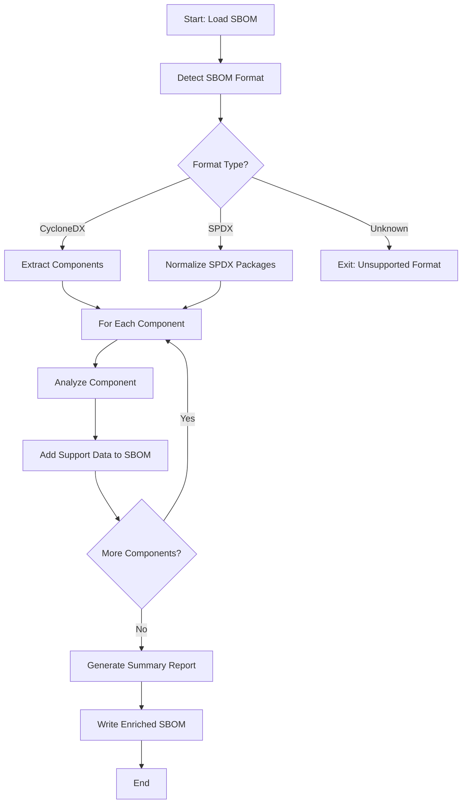
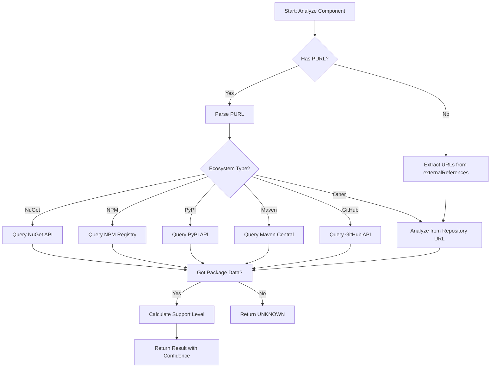
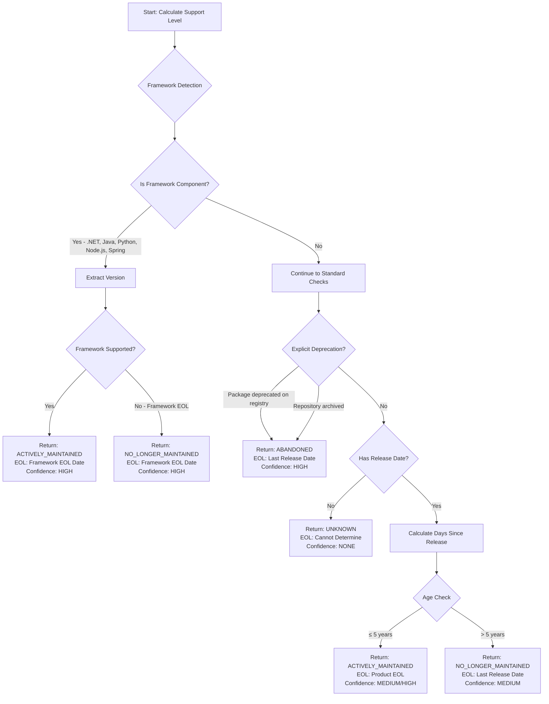
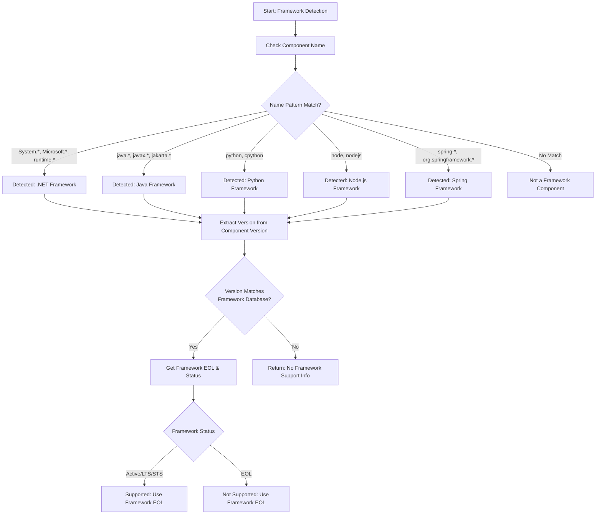
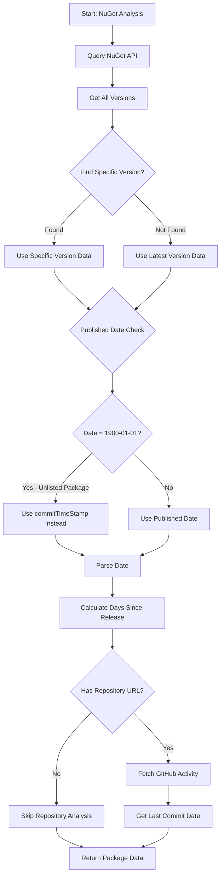
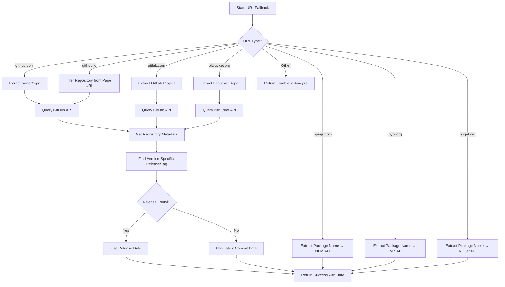
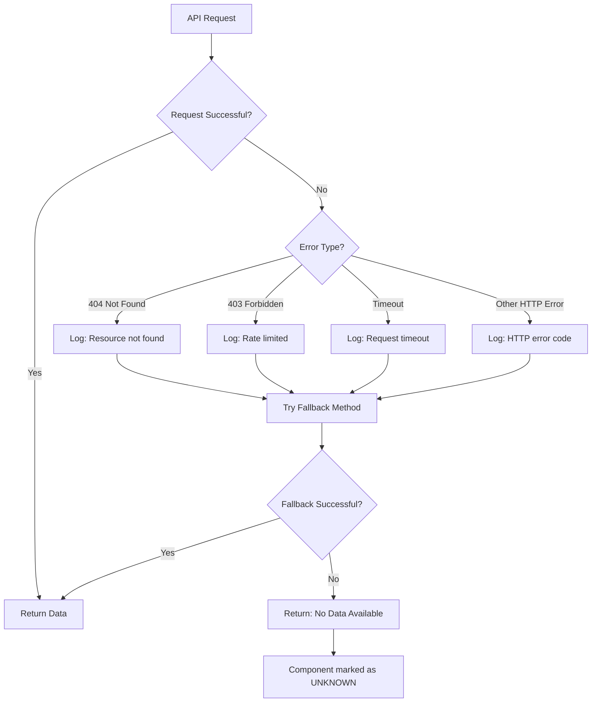

# SBOM Support Analyzer - Logic Flowchart

This document provides a visual representation of the SBOM Support Analyzer's classification logic.

## Overview Flow



## Component Analysis Flow



## Support Level Classification Flow



## Framework Detection Flow



## NuGet Package Analysis Flow



## URL Fallback Mechanism Flow



## Decision Matrix

### Support Level Decision Table

| Condition | Framework Match | Explicit Deprecation | Age (Years) | Repository Status | Result | Confidence |
|-----------|----------------|---------------------|-------------|-------------------|--------|------------|
| 1 | ✅ Framework Supported | - | - | - | **ACTIVELY_MAINTAINED** | HIGH |
| 2 | ✅ Framework EOL | - | - | - | **NO_LONGER_MAINTAINED** | HIGH |
| 3 | ❌ | ✅ Deprecated | - | - | **ABANDONED** | HIGH |
| 4 | ❌ | ❌ | ≤ 5 | Active | **ACTIVELY_MAINTAINED** | HIGH |
| 5 | ❌ | ❌ | ≤ 5 | Inactive | **ACTIVELY_MAINTAINED** | MEDIUM |
| 6 | ❌ | ❌ | > 5 | Any | **NO_LONGER_MAINTAINED** | MEDIUM |
| 7 | ❌ | ❌ | No Data | - | **UNKNOWN** | NONE |

### EOL Date Assignment Logic

| Classification | Framework Component | Has Product EOL | EOL Date Assigned |
|----------------|---------------------|-----------------|-------------------|
| ACTIVELY_MAINTAINED | ✅ Yes | - | Framework EOL Date |
| ACTIVELY_MAINTAINED | ❌ No | ✅ Yes | Product EOL Date |
| ACTIVELY_MAINTAINED | ❌ No | ❌ No | "Not specified" |
| NO_LONGER_MAINTAINED | - | - | Last Release Date |
| ABANDONED | - | - | Last Release Date |
| UNKNOWN | - | - | "Cannot determine" |

## Key Features Illustrated

### 1. Framework Detection Priority
```
Component Analysis Order:
┌─────────────────────────────────────┐
│ 1. Framework Detection              │ ← FIRST (v1.4.0+)
│    └─ Pattern match component name  │
│    └─ Extract version               │
│    └─ Lookup framework support      │
├─────────────────────────────────────┤
│ 2. Explicit Deprecation Check       │
│    └─ Package registry deprecated   │
│    └─ Repository archived           │
├─────────────────────────────────────┤
│ 3. Age-Based Classification          │
│    └─ Calculate days since release  │
│    └─ Apply 5-year threshold        │
└─────────────────────────────────────┘
```

### 2. Version-Specific Analysis
```
SBOM Component: Google.Protobuf @ 3.21.7
                        │
                        ↓
┌───────────────────────────────────────────┐
│ NuGet API Query                           │
│ ├─ Find ALL versions                      │
│ ├─ Search for 3.21.7 specifically         │
│ └─ Use 3.21.7 data (NOT latest)          │
└───────────────────────────────────────────┘
                        │
                        ↓
        Uses: Release date of 3.21.7
        NOT: Latest version 4.x date
```

### 3. Unlisted Package Handling
```
NuGet API Response for Unlisted Package:
┌─────────────────────────────────────────┐
│ {                                        │
│   "published": "1900-01-01T00:00:00Z",  │ ← Placeholder
│   "commitTimeStamp": "2022-05-24...",   │ ← Actual Date
│   "listed": false                        │
│ }                                        │
└─────────────────────────────────────────┘
                   │
                   ↓
        Analyzer detects 1900-01-01
                   │
                   ↓
        Uses commitTimeStamp instead
```

## Example Component Analysis Traces

### Example 1: .NET Runtime Component
```
Input: runtime.native.System.IO.Ports @ 8.0.0

┌─────────────────────────────────────────────────────┐
│ 1. Parse PURL → Ecosystem: nuget                    │
│ 2. Query NuGet API → Last Release: 2023-11-14       │
│ 3. Framework Detection:                              │
│    ├─ Pattern Match: runtime.* → .NET Framework     │
│    ├─ Version Match: 8.0.0 → .NET 8.0              │
│    └─ Framework Status: LTS (EOL: 2026-11-10)      │
│ 4. Classification Override:                          │
│    └─ ACTIVELY_MAINTAINED (Framework Supported)     │
│ 5. EOL Assignment: 2026-11-10 (Framework EOL)       │
│ 6. Confidence: HIGH                                  │
└─────────────────────────────────────────────────────┘

Result: ✅ ACTIVELY_MAINTAINED | EOL: 2026-11-10 | HIGH
```

### Example 2: Regular NuGet Package
```
Input: Autofac @ 8.2.0

┌─────────────────────────────────────────────────────┐
│ 1. Parse PURL → Ecosystem: nuget                    │
│ 2. Query NuGet API → Last Release: 2024-12-17       │
│ 3. Framework Detection:                              │
│    └─ No Match (Not a framework component)          │
│ 4. Explicit Deprecation Check:                       │
│    └─ Not deprecated                                 │
│ 5. Age-Based Classification:                         │
│    ├─ Days Since Release: 301 days                  │
│    ├─ Within 5 years? YES                           │
│    └─ ACTIVELY_MAINTAINED                           │
│ 6. EOL Assignment: Product EOL (2030-12-31)         │
│ 7. Confidence: MEDIUM (no recent commits)           │
└─────────────────────────────────────────────────────┘

Result: ✅ ACTIVELY_MAINTAINED | EOL: 2030-12-31 | MEDIUM
```

### Example 3: Unlisted Package
```
Input: GrapeCity.Documents.Common @ 4.2.0.722

┌─────────────────────────────────────────────────────┐
│ 1. Parse PURL → Ecosystem: nuget                    │
│ 2. Query NuGet API:                                  │
│    ├─ Published: 1900-01-01 (Unlisted placeholder)  │
│    └─ CommitTimeStamp: 2022-05-24 ✓                │
│ 3. Date Correction: Use 2022-05-24                  │
│ 4. Framework Detection: No Match                     │
│ 5. Age-Based Classification:                         │
│    ├─ Days Since Release: 1240 days (3.4 years)    │
│    ├─ Within 5 years? YES                           │
│    └─ ACTIVELY_MAINTAINED                           │
│ 6. EOL Assignment: Product EOL (2030-12-31)         │
│ 7. Confidence: MEDIUM                                │
└─────────────────────────────────────────────────────┘

Result: ✅ ACTIVELY_MAINTAINED | EOL: 2030-12-31 | MEDIUM
```

### Example 4: Old Framework Version
```
Input: runtime.native.System.Data.SqlClient.sni @ 4.4.0

┌─────────────────────────────────────────────────────┐
│ 1. Parse PURL → Ecosystem: nuget                    │
│ 2. Query NuGet API → Last Release: 2017-08-11       │
│ 3. Framework Detection:                              │
│    ├─ Pattern Match: runtime.* → .NET Framework     │
│    ├─ Version Match: 4.4.0 → No matching framework │
│    └─ No framework support info found               │
│ 4. Age-Based Classification:                         │
│    ├─ Days Since Release: 2986 days (8.2 years)    │
│    ├─ Within 5 years? NO                            │
│    └─ NO_LONGER_MAINTAINED                          │
│ 5. EOL Assignment: 2017-08-11 (Last Release)        │
│ 6. Confidence: MEDIUM                                │
└─────────────────────────────────────────────────────┘

Result: ⚠️ NO_LONGER_MAINTAINED | EOL: 2017-08-11 | MEDIUM
```

## Data Flow Architecture

```
┌───────────────────────────────────────────────────────────────────┐
│                           INPUT SBOM                               │
│                    (CycloneDX or SPDX JSON)                       │
└────────────────────────────────┬──────────────────────────────────┘
                                 │
                                 ↓
┌───────────────────────────────────────────────────────────────────┐
│                      SBOM FORMAT DETECTION                         │
│  ├─ Check bomFormat field (CycloneDX)                            │
│  ├─ Check spdxVersion field (SPDX)                               │
│  └─ Normalize to common component structure                       │
└────────────────────────────────┬──────────────────────────────────┘
                                 │
                                 ↓
┌───────────────────────────────────────────────────────────────────┐
│                    COMPONENT EXTRACTION                            │
│  ├─ CycloneDX: components[] array                                │
│  └─ SPDX: packages[] → normalize to components                   │
└────────────────────────────────┬──────────────────────────────────┘
                                 │
                                 ↓
┌───────────────────────────────────────────────────────────────────┐
│                   FOR EACH COMPONENT LOOP                          │
└────────────────────────────────┬──────────────────────────────────┘
                                 │
        ┌────────────────────────┴────────────────────────┐
        │                                                  │
        ↓                                                  ↓
┌──────────────────┐                            ┌──────────────────┐
│  DATA SOURCES    │                            │  ANALYSIS LOGIC  │
├──────────────────┤                            ├──────────────────┤
│ • NuGet API      │────────────────────────────│ 1. Framework     │
│ • NPM Registry   │                            │    Detection     │
│ • PyPI API       │                            │                  │
│ • Maven Central  │                            │ 2. Deprecation   │
│ • GitHub API     │                            │    Check         │
│ • GitLab API     │                            │                  │
│ • Bitbucket API  │                            │ 3. Age-Based     │
└──────────────────┘                            │    Classification│
                                                └────────┬─────────┘
                                                         │
                                                         ↓
                                              ┌──────────────────────┐
                                              │  SUPPORT LEVEL       │
                                              │  + EOL DATE          │
                                              │  + CONFIDENCE        │
                                              └──────────┬───────────┘
                                                         │
                                                         ↓
┌───────────────────────────────────────────────────────────────────┐
│                    ENRICHED SBOM OUTPUT                            │
│  ├─ Original SBOM + Support Analysis Properties                   │
│  ├─ CycloneDX: Added to properties[] array                        │
│  └─ SPDX: Added to annotations[] array                            │
└────────────────────────────────┬──────────────────────────────────┘
                                 │
                                 ↓
┌───────────────────────────────────────────────────────────────────┐
│                      SUMMARY REPORT JSON                           │
│  ├─ Total components by support level                             │
│  ├─ API request counts                                             │
│  ├─ Component details array                                        │
│  └─ Analysis timestamp                                             │
└───────────────────────────────────────────────────────────────────┘
```

## Performance & Optimization

### Caching Strategy
```
┌──────────────────────────────────────┐
│ Request Cache (In-Memory Dictionary) │
├──────────────────────────────────────┤
│ Key: API URL                          │
│ Value: JSON Response                  │
│                                       │
│ Benefits:                             │
│ • Avoid duplicate API calls           │
│ • Faster re-analysis                  │
│ • Rate limit preservation             │
└──────────────────────────────────────┘
```

### API Rate Limiting
```
Without GitHub Token:  60 requests/hour
With GitHub Token:     5000 requests/hour

Rate Limit Strategy:
├─ Cache all responses
├─ 0.5 second delay between components
└─ Prioritize PURL-based analysis (fewer API calls)
```

## Error Handling Flow



## Version History

- **v1.4.0**: Added Framework Detection & NuGet Unlisted Package Fix
- **v1.3.0**: FDA-Aligned Categories (3 levels)
- **v1.2.0**: Product-Based EOL Model
- **v1.1.0**: Version-Specific Analysis & URL Fallback
- **v1.0.0**: Initial Release

---

*This flowchart is maintained alongside the codebase. For implementation details, see [sbom_support_analyzer.py](../sbom_support_analyzer.py).*
